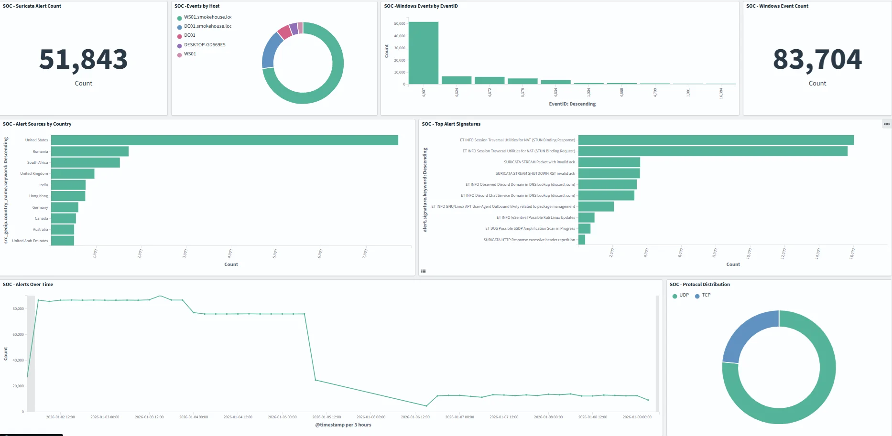
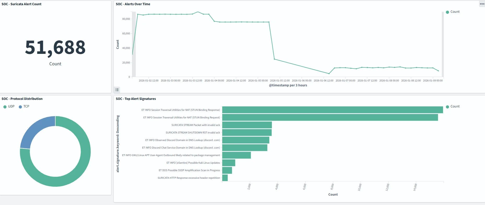
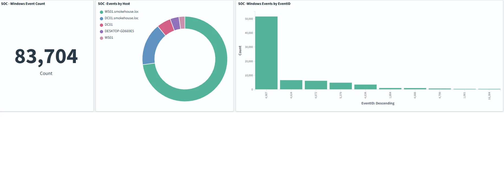
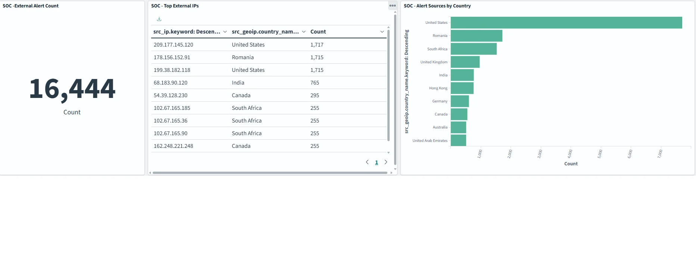

# 🛡️ HomeLab SOC v2

[](https://opensearch.org/)
[](https://suricata.io/)
[](https://docker.com/)
[](https://cloudflare.com/)
[](https://opnsense.org/)

A production-grade Security Operations Center built on consumer hardware, demonstrating enterprise security monitoring capabilities in a home lab environment.

**Live Infrastructure:** This SOC actively monitors [brianchaplow.com](https://brianchaplow.com) and [bytesbourbonbbq.com](https://bytesbourbonbbq.com), processing real attack traffic and automatically blocking threats.

---

## 🔄 Evolution: v1 → v2

This is the **second iteration** of my HomeLab SOC project. The original ([HomeLab-SOC](https://github.com/brianchaplow/HomeLab-SOC)) proved the concept; v2 implements enterprise-grade architecture.

| Aspect | v1 (Original) | v2 (Current) |
|--------|---------------|--------------|
| **Network** | Flat 192.168.50.0/24 | 5 VLANs (10.10.x.0/24) |
| **Firewall** | Consumer router (ASUS) | OPNsense on Protectli VP2420 |
| **Switching** | TP-Link TL-SG108E (8-port 1G) | MokerLink 10G L3 (8×10G + 4×SFP+) |
| **Traffic Capture** | Basic SPAN | Full port mirror with VLAN visibility |
| **Purple Team** | Kali only | Isolated VLAN 40 with DVWA, Juice Shop, Metasploitable |
| **AD Lab** | None | smokehouse.local (DC01 + WS01) with Sysmon |
| **IPs Blocked** | 100+ | 1,459+ |
| **Dashboards** | Basic | 4 purpose-built (SOC Overview, NIDS, Endpoint, Threat Intel) |

**Why v2?** The flat network worked for learning but couldn't simulate enterprise conditions. Proper VLAN segmentation enables realistic purple team exercises where attack traffic is isolated, monitored, and logged—just like a production environment.

---

## 📊 Key Metrics

| Metric | Value |
|--------|-------|
| 🎯 **Suricata Rules** | 47,487 (ET Open) |
| 🚫 **IPs Auto-Blocked** | 1,459+ at Cloudflare edge |
| 🌐 **VLANs** | 5 (enterprise segmentation) |
| 🖥️ **Windows Events** | 83K+ across AD lab |
| 🗺️ **Countries Detected** | 15+ source countries |
| ⏱️ **Enrichment Cycle** | Every 15 minutes |

---

## 🏗️ Architecture

Traffic flows through three security layers before reaching the SOC:

```
                         ┌─────────────────────┐
                         │      INTERNET       │
                         └──────────┬──────────┘
                                    │
               ┌────────────────────▼────────────────────┐
               │          CLOUDFLARE (Edge)              │
               │   WAF • Bot Fight Mode • JA3            │
               │   Auto-block API ← SOC Automation       │
               │   brianchaplow.com • bytesbourbonbbq.com│
               └────────────────────┬────────────────────┘
                                    │
               ┌────────────────────▼────────────────────┐
               │          GCP VM (Origin)                │
               │   Apache • Fluent Bit • Umami           │
               │   <gcp-public-ip> (Tailscale: <gcp-tailscale-ip>)│
               └────────────────────┬────────────────────┘
                                    │
                       Tailscale WireGuard Tunnel
                                    │
               ┌────────────────────▼────────────────────┐
               │         OPNsense Firewall               │
               │   Protectli VP2420 • VLAN Gateway       │
               │   10.10.10.1                            │
               └────────────────────┬────────────────────┘
                                    │
               ┌────────────────────▼────────────────────┐
               │        MokerLink 10G Switch             │
               │   12-Port L3 • Port Mirror (SPAN)       │
               │   10.10.10.2 • All VLANs → eth4         │
               └────────────────────┬────────────────────┘
                                    │
      ┌───────────┬─────────────────┼─────────────────┬───────────┐
      │           │                 │                 │           │
   VLAN 10     VLAN 20           VLAN 30          VLAN 40     VLAN 50
   Mgmt        SOC               Lab              Targets     IoT
 10.10.10.x  10.10.20.x        10.10.30.x       10.10.40.x  10.10.50.x
      │           │                 │                 │           │
   PITBOSS   ┌────┴────┐      ┌─────┴─────┐     ┌────┴────┐   TP-Link
             │smokehouse│      │  Proxmox  │     │ DVWA    │   Switch
             │(QNAP)   │      │ pitcrew   │     │ Juice   │
             │OpenSearch│      │ smoker    │     │ Shop    │
             │Suricata │      ├───────────┤     │ Meta-   │
             │9 contain.│      │  AD Lab   │     │ sploit  │
             ├─────────┤      │ DC01/WS01 │     │ able    │
             │  sear   │      │smokehouse │     │         │
             │ (Kali)  │      │  .local   │     │ISOLATED │
             └─────────┘      └───────────┘     └─────────┘
                  │                                   ▲
                  │        Purple Team Attacks        │
                  └───────────────────────────────────┘
```

### Data Flows

```
Web Traffic:     Internet → Cloudflare → GCP → Tailscale → OpenSearch
SPAN Capture:    All VLANs → MokerLink TE10 → smokehouse eth4 → Suricata
Windows Events:  DC01/WS01 → Sysmon → Fluent Bit → OpenSearch
Threat Intel:    New IP → AbuseIPDB → Score ≥90 → Cloudflare Auto-Block
Purple Team:     sear (VLAN 20) → Targets (VLAN 40) → Detection Validation
```


---

## 🌐 Network Segmentation

| VLAN | Name | Subnet | Purpose |
|------|------|--------|---------|
| 10 | Management | 10.10.10.0/24 | Network device administration |
| 20 | SOC | 10.10.20.0/24 | smokehouse (QNAP), sear (Kali) |
| 30 | Lab | 10.10.30.0/24 | Proxmox hosts, AD domain |
| 40 | Targets | 10.10.40.0/24 | Isolated vulnerable VMs |
| 50 | IoT | 10.10.50.0/24 | Smart home (segmented) |

### Firewall Rules

| Source | Destination | Action | Purpose |
|--------|-------------|--------|---------|
| SOC (VLAN 20) | All VLANs | Allow | Monitoring access |
| Lab (VLAN 30) | Targets (VLAN 40) | Allow | Purple team attacks |
| Targets (VLAN 40) | Any | Deny | Complete isolation |
| IoT (VLAN 50) | Internet only | Allow | Block lateral movement |

### BBQ-Themed Naming Convention 🍖

| Hostname | Role | VLAN | IP |
|----------|------|------|-----|
| **smokehouse** | QNAP NAS (SOC platform) | 20 | 10.10.20.10 |
| **sear** | Kali attack box | 20 | 10.10.20.20 |
| **PITBOSS** | Windows laptop | 10 | 10.10.10.100 |
| **pitcrew** | Proxmox (AD lab) | 30 | 10.10.30.20 |
| **smoker** | Proxmox (targets) | 30 | 10.10.30.21 |

---

## 🔧 Components

### SOC Stack (smokehouse - 10.10.20.10)

| Container | Port | Purpose |
|-----------|------|---------|
| **OpenSearch** | 9200 | SIEM backend, log storage |
| **OpenSearch Dashboards** | 5601 | Visualization, threat hunting |
| **Suricata** | Host network | Network IDS (47,487 rules) |
| **Fluent Bit** | 5514 | Log aggregation |
| **soc-automation** | — | Enrichment, auto-blocking |
| **Zeek** | — | Network security monitor |
| **CyberChef** | 8000 | Data analysis |
| **InfluxDB** | 8086 | Time-series metrics |
| **Grafana** | 3000 | Infrastructure dashboards |

### AD Lab (VLAN 30)

| VM | IP | Role |
|----|-----|------|
| DC01 | 10.10.30.40 | Domain Controller (Server 2022) |
| WS01 | 10.10.30.41 | Workstation (Windows 10) |

**Domain:** smokehouse.local  
**Telemetry:** Sysmon deployed via GPO → Fluent Bit → OpenSearch

### Purple Team Targets (VLAN 40 - Isolated)

| Target | IP | Purpose |
|--------|-----|---------|
| DVWA | 10.10.40.10 | Web app vulnerabilities |
| Juice Shop | 10.10.40.11 | OWASP vulnerable app |
| Metasploitable | 10.10.40.20 | Classic practice target |

---

## 📈 Dashboards

Four purpose-built dashboards for different operational needs:

### SOC Overview (Portfolio Hero)
Executive view showing combined network + endpoint coverage with geographic threat distribution and 7-day timeline.

### NIDS - Detection Overview
Suricata operational metrics: alert volume, top signatures, protocol breakdown, source/destination analysis.

### Endpoint - Windows Security
Windows telemetry from AD lab: event distribution, Sysmon coverage, authentication patterns (4624/4625/4672).

### SOC - Threat Intelligence
External threat assessment: AbuseIPDB enrichment, auto-blocked IP tracking, geographic origins, risk scores.

---

## 📸 Screenshots

<details>
<summary>Click to expand dashboard screenshots</summary>

### SOC Overview
Executive summary combining Suricata IDS alerts (51K+), Windows endpoint events (83K+), geographic threat distribution, and 7-day timeline.



### NIDS - Detection Overview
Suricata operational metrics showing protocol distribution, top alert signatures, and alert volume over time.



### Endpoint - Windows Security
Windows event telemetry from AD lab (DC01, WS01) showing EventID distribution across domain-joined hosts.



### Threat Intelligence
External threat analysis showing top attacking IPs, geographic sources, and alert counts.



</details>

---

## ⚡ Automation

| Schedule | Script | Function |
|----------|--------|----------|
| Every 15 min | `enrichment.py` | Query AbuseIPDB for new IPs |
| Hourly | `autoblock.py` | Push score≥90 IPs to Cloudflare |
| 0600/1800 | `digest.py` | Watch turnover reports |
| Sunday 0800 | `digest.py --weekly` | Weekly threat summary |

**Auto-Block Criteria:**
- AbuseIPDB confidence score ≥ 90
- Minimum 5 reports
- Pushed to Cloudflare account-level firewall
- Blocks across all domains automatically

**Alerts:** Discord webhooks + email (soc-alerts@brianchaplow.com)

---

## 📁 Repository Structure

```
HomeLab-SOC-v2/
├── README.md
├── CHANGELOG.md              # v1 → v2 migration notes
├── configs/
│   ├── .env.example          # Environment template
│   ├── docker-compose.yml    # Full SOC stack
│   ├── fluent-bit/
│   │   ├── fluent-bit-qnap.conf
│   │   ├── fluent-bit-vm.conf
│   │   ├── fluent-bit-windows.yaml
│   │   ├── parsers-qnap.conf
│   │   ├── parsers-vm.conf
│   │   └── sysmon_parser.lua
│   └── opensearch/
│       └── geoip-pipeline.json
├── scripts/
│   ├── soc-startup.sh        # QNAP boot script
│   └── soc-automation/
│       ├── Dockerfile
│       ├── requirements.txt
│       ├── enrichment.py
│       ├── autoblock.py
│       └── digest.py
├── dashboards/
│   ├── soc-overview-portfolio.ndjson
│   ├── nids-detection-overview.ndjson
│   ├── endpoint-windows-security.ndjson
│   └── soc-threat-intelligence.ndjson
├── detection-examples/
│   ├── sqlmap-detection.md   # SQLmap attack → alert walkthrough
│   └── sample-alerts.json
├── docs/
│   └── architecture.md       # Detailed technical docs
└── screenshots/
    ├── soc-architecture-v2.png
    └── dashboard-*.png
```

---

## 🚀 Quick Start

### Prerequisites

- Docker & Docker Compose
- Linux server (QNAP, Proxmox, or similar)
- Cloudflare account (free tier works)
- AbuseIPDB API key (free: 1000 checks/day)
- MaxMind GeoLite2 license (free)

### Deployment

1. **Clone the repository**
   ```bash
   git clone https://github.com/brianchaplow/HomeLab-SOC-v2.git
   cd HomeLab-SOC-v2
   ```

2. **Configure environment**
   ```bash
   cp configs/.env.example configs/.env
   # Edit with your API keys
   ```

3. **Deploy stack**
   ```bash
   cd configs
   docker-compose up -d
   ```

4. **Access dashboards**
   - OpenSearch Dashboards: `http://<your-ip>:5601`
   - CyberChef: `http://<your-ip>:8000`

See [docs/architecture.md](docs/architecture.md) for detailed setup and VLAN configuration.

---

## 🎯 Purple Team Validation

Detection without validation is just hope. The isolated VLAN 40 enables attack simulation:

```bash
# SQLmap injection test (from sear on VLAN 20 → DVWA on VLAN 40)
sqlmap -u "http://10.10.40.10/vulnerabilities/sqli/?id=1" \
       --cookie="PHPSESSID=xxx;security=low" \
       --batch --dbs
```

**Results:**
- 10,000+ flow records captured by Suricata
- SQL injection signatures triggered
- Full attack timeline in OpenSearch
- Target isolation verified (couldn't reach SOC or escape VLAN 40)

See [detection-examples/sqlmap-detection.md](detection-examples/sqlmap-detection.md) for full walkthrough.

---

## 🗺️ Roadmap

### Completed (v2)
- [x] Core SIEM (OpenSearch + Fluent Bit)
- [x] Network IDS (Suricata 47K+ rules)
- [x] Automated threat intel (AbuseIPDB)
- [x] Edge auto-blocking (Cloudflare API)
- [x] GeoIP enrichment (MaxMind + CF headers)
- [x] VLAN segmentation (5 VLANs, OPNsense + MokerLink)
- [x] AD Lab with Sysmon telemetry
- [x] Purple team target range (isolated VLAN 40)
- [x] 4 purpose-built dashboards

### In Progress
- [ ] Sigma rules for Windows detection
- [ ] MITRE ATT&CK dashboard mapping
- [ ] Atomic Red Team integration

### Planned
- [ ] Index lifecycle management
- [ ] Wazuh agent deployment
- [ ] Automated purple team playbooks

---

## 🛠️ Tech Stack

| Category | Technologies |
|----------|-------------|
| **Firewall** | OPNsense (Protectli VP2420) |
| **Switching** | MokerLink 10G (L3, SPAN) |
| **SIEM** | OpenSearch, OpenSearch Dashboards |
| **Network Security** | Suricata, Zeek |
| **Log Pipeline** | Fluent Bit |
| **Edge Security** | Cloudflare WAF, Bot Fight Mode |
| **Threat Intel** | AbuseIPDB, MaxMind GeoLite2 |
| **Connectivity** | Tailscale (WireGuard) |
| **Containers** | Docker, Docker Compose |
| **Automation** | Python, Cron |
| **Alerting** | Discord Webhooks, Email |

---

## 👤 Author

**Brian Chaplow**

- 🌐 Website: [brianchaplow.com](https://brianchaplow.com)
- 💼 LinkedIn: [linkedin.com/in/brianchaplow](https://linkedin.com/in/brianchaplow)
- 🐙 GitHub: [@brianchaplow](https://github.com/brianchaplow)
- 🍖 Blog: [bytesbourbonbbq.com](https://bytesbourbonbbq.com)

---

## 📄 License

MIT License - see [LICENSE](LICENSE)

---

## 🙏 Acknowledgments

- [Emerging Threats Open](https://rules.emergingthreats.net/) - Suricata ruleset
- [SwiftOnSecurity](https://github.com/SwiftOnSecurity/sysmon-config) - Sysmon inspiration
- [AbuseIPDB](https://abuseipdb.com) - Threat intelligence
- [MaxMind](https://maxmind.com) - GeoIP databases
